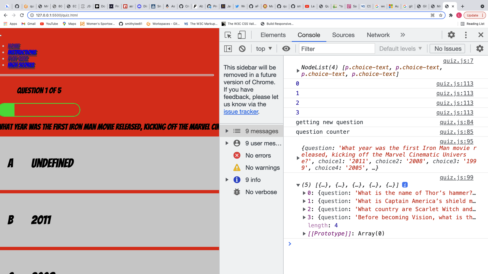

<h1 align ="center">MARVELous Quiz</h1>

[View the live project here.](https://smithylee81.github.io/MARVELous-Quiz/)

>A simple quiz website for users to visit and challenge themselves on their favourite MARVEL movies. The website is designed to be responsive and accessible on a wide range of devices, making it easy for everyone to access and play whether they're on the go or sitting at a desktop.

<h2 align ="center"></h2>

## User Experience (UX)
---

- ### User Stories

    - #### First Time Visitor Goals
        1. As a First Time Visitor, I want to easily understand the purpose of the site, see basic instructions on how to play the quiz and be able to start playing the quiz to challenge myself on my knowledge of my favourite MARVEL movies. 
        2. As a First Time Visitor, I want to be able to navigate through the site in an organic manner, see previous High Scores and challenge myself to get a good score. 
        3. As a First Time Visitor, I want to be visually impressed with a MARVEL themed colour scheme and authentic font styling that’s in keeping with the MARVEL franchise and sets the mood for an avid MARVEL fan.

    - #### Returning Visitor Goals
        1. As a Returning Visitor, I want to be able to check High Scores and see if any of my friends have beaten my score. 
        2. As a Returning Visitor, I also want to be able to take the quiz again to try and beat my previous score. 

    - #### Frequent User Goals
        1. As a Frequent User, I want to check out the high scores page and see if anyone has beaten my score.
        2. As a Frequent User, I want to be able to continue to navigate the site with ease and see a consistent page layout that I remain familiar with. 

- ### Design

  - #### Colour Scheme
    - ##### A blend of MARVEL themed colouring to include strong bold colours in keeping with the MARVEL franchise. This will help set the mood for the ultimate MARVEL fan. 

  - #### Typography
    - ##### The MARVEL theme is continued with use of a comic book style font from Google Fonts named ‘Bangers’ and gives the site a MARVEL themed look and feel. 

  - #### Imagery
    - ##### To coincide with the colour scheme and overall MARVEL themed site, some pictures of MARVEL characters have been utilised to keep the theme.

- ### UX Design Planes
    - #### Strategy
        - ##### My aim of the design is to make this a simple, ease of use website for individuals wishing to test their knowledge on their favourite MARVEL movies and compete against their friends to obtain the highest score.

    - #### Scope
        - ##### I want to provide the users with a brief overview of the instructions for the quiz and provide an easy navigation experience throughout the quiz.

    - #### Structure
        - ##### I want the site to be intuitive, consistent, and easy to navigate. I aim to keep the pages basic and easy to use with a bold colour scheme in keeping with the MARVEL theme. I aim to keep the pages similar throughout for ease of use and include MARVEL images to keep the theme.

    - #### Skeleton
        - ##### Wireframes - [View](https://github.com/smithylee81/MARVELous-Quiz/blob/3397d173bde5189ecc6d41a079ff762cc4336707/Wireframes) Basic drawings have been produced rather than on the Balsamiq website keeping things simplistic.

    - #### Surface
        - ##### The colour scheme together with the imagery described was used to create an overall eye-catching MARVEL themed experience with a Comic book feel.
---
## Features

- ### Interactive site challenging the user’s knowledge of MARVEL movies 
- ### Responsive on all devices

---
## Technologies Used
### Languages:

- ### HTML5
- ### CSS3
- ### JavaScript
---
## Frameworks, Libraries & Programs Used / Resources

1. [Bootstrap v5.1](https://getbootstrap.com/docs/5.1/getting-started/introduction/)
    - Bootstrap was be used to assist me with styling and responsiveness.
2. [Font Awesome v5.15.4:](https://fontawesome.com/)
    - Font Awesome was used to add icons for aesthetic and UX purposes.
3. [Git:](https://git-scm.com/)
    - Git was used for version control utilising the 'Gitpod Terminal' to 'Commit' and 'Push' to GitHub.
4. [GitPod:](https://gitpod.io/workspaces/)
    - GitPod was be used as the main workspace for writing the code.
5. [GitHub:](https://github.com/)
    - GitHub was be used to store the code after being 'Pushed' from Gitpod.
6. [Google Fonts:](https://fonts.google.com/)
    - Google fonts were used to import the font styles into the style.css file which is used on all pages throughout the site.
7. [JQuery JavaScript Library](https://cdnjs.com/libraries/jquery)
    - JQuery Library utilised for JavaScript files.

---

## Testing

- ### The W3C CSS Validator Service and HTML checker was used to validate the HTML and CSS pages of the project to ensure there were no significant errors.  

- ### JS HINT was used to validate the JavaScript files. 

- ### The Website was tested on Google Chrome, Firefox and Safari browsers.
- ### The website was viewed on a variety of devices such as Desktop, Laptop, various iPhones and iPads.
- ### Testing was done to ensure that the page links worked correctly, and all pages were interactive.
- ### Friends and family members were also asked to review the site and documentation to point out any bugs and/or user experience issues.

## Testing User Stories from User Experience (UX) Section

- ### First Time Visitor Goals

    - #### As a first-time visitor,I want to easily understand the main purpose of the site, easily navigate to the instructions, and take the quiz.
        1. Upon entering the site, users are greeted with an easily readable and clean title and navigation bar to allow access to the page of their choice. Below this there is an image of the MARVEL logo, so the purpose of the site is clear.
        2. The user has options to hover over and click the page links to each section. The hover effect works well assisting the user in seeing which section they are selecting.
        3. As a first-time visitor, the user can select the High Scores page and see scores from previous players.
        4. At the bottom of the page, the footer, the user has options to select Facebook, GitHub, LinkedIn and Discord to find out more about the Developer. These links open in a new tab for ease of use and navigating in their browser without losing the original page/site.

- ### Returning Visitor Goals

    - #### As a returning visitor,I want to check if there are anything new on the page, check the High Scores page to see if any of my friends have beaten my score and take the Quiz again if wished.
        1. Upon re-entering the site the user has familiarity given the sites consistency and its ease of use helps them navigate to the desired sections.
        2. The user can assess whether anything has changed since their last viewing of the site and check the high scores page to see if anyone has beaten their score.
        3. The user can navigate between the pages using the Nav Bar at the top of each page and also select the social media icons on each page via the footer if they wish to view the Developers’ platforms.

- ### Frequent User Goals
    - #### As a frequent visitor,I want to be able to see any new changes and challenge myself on my Marvel knowledge.
        1. The user would already be comfortable with the website layout and can easily navigate between the pages.

## Further Testing

- ### Manual Testing of each section
- #### Home Page/Navigation Bar: All page links were tested to ensure they take the user to the desired area on the page, the dropdown menu was also tested on smaller devices to ensure the user still had these options on their mobile/smaller device.

- Testing the navigation bar to ensure this takes the user to the different areas of the site:
    
    - #### Home Page,    :

### Testing Site Responsiveness
- #### Testing responsiveness was carried out using Dev.Tools on a variety of screen sizes as demonstrated below:
    - ##### Home Page - Moto G4
    
    - ##### Home Page - Pixel 2
    
    - ##### Home Page - iPhone 5/SE
    
    - ##### Home Page - iPhone 6/7/8
    
    - ##### Home Page - iPhone 6/7/8 Plus
    
    - ##### Home Page - iPad
    
    - ##### Home Page - Surface Duo
    
    - ##### Home Page - Nest Hub Max
    

### Known/Solved Bugs
- #### Hero Image (Marvel Logo) on Home Page not responsive with a breakpoint at 770px, anything below this point the window covers the image:

This was overcome by adding further css properties with a margin: auto; display: flex; align-items: center; justify-content: center; as per the final Home Page display. 

- #### The Instructions area also had a breakpoint on larger screens where it would display to the left of the screen above 922px and on smaller screens the content would spill over into other screen areas on screens below 374px:

This was overcome by adding further css properties with a margin: auto; and removing the height: 10em; property as per the final Home Page display.

- #### The Quiz page Marvel Images had were larger on large screens with a margin to the right showing empty space, on smaller screens these would display to the left and where considerably smaller:

This was overcome by adding further css properties with a display: flex; align-items: center; justify-content: center; and a margin left and right of 0.5rem, as per the final Quiz Page display.

- #### The initial JavaScript code wouldn't display any questions or choices.After running the quiz.js file through 'JS Hint', this showed that there were some warnings (mainly in connection with ES6 version), missing semicolons and there were some 'undefined variables':

- ##### 'const' is available in ES6 (use 'esversion: 6') or Mozilla JS extensions (use moz).
- ##### 'let' is available in ES6 (use 'esversion: 6') or Mozilla JS extensions (use moz).
- ##### 'arrow function syntax (=>)' is only available in ES6 (use 'esversion: 6').
- ##### 'spread operator' is only available in ES6 (use 'esversion: 6').
- ##### 'template literal syntax' is only available in ES6 (use 'esversion: 6').
- ##### ['number'] is better written in dot notation.

- ##### JSHINT Undefined Variables: startGame, getNewQuestion and incrementScore.

This was overcome by adding 'const' to the undefined properties highlighted and adding the semicolons. 

- #### Once the variables had been defined the quiz page displayed the questions and answers/choices but would not display the 1st choice answer displaying 'undefined'. On review of the quiz.html file to assess any issues it was noted I'd mistyped writing 'number' instead of 'data-number':

This was overcome by adding 'data-' to number in the html. 

---

## Project Barriers & Solutions

- ### Within the JavaScript there was an issue with the questions and answers displaying, in addition to the above solutions outlined within the 'Known/Solved Bugs' section, some of the JavaScript code required changing, specifically the following:

"const choices = Array.from(document.querySelector('.choice-text'));" changed to "const choices = document.querySelectorAll('.choice-text');"

Applied the prefix over postfix in "questionCounter++",changed to "++questionCounter". 

- ### Once all JavaScript was addressed there remained an issue with the Question and Choices display where on a mobile these would not display:

This was overcome by changing the section div from 'container-fluid' to 'container'.

---

## Version Control

- ### GitHub and GitPod used throughout for project using git commands to push to GitHub repository, VS Code platform used in later stages.

---

## Deployment
### GitHub Pages
 - The project was deployed to GitHub Pages using the following steps...

1. Log in to GitHub and locate the [GitHub Repository](https://github.com/)
2. At the top of the Repository (not top of page), locate the "Settings" Button on the menu.
3. Scroll down the Settings page until you locate the "GitHub Pages" Section.
4. Under "Source", click the dropdown called "None" and select "Master Branch".
5. The page will automatically refresh.
6. Scroll back down through the page to locate the now published site [https://smithylee81.github.io/MARVELous-Quiz/](https://github.com) in the "GitHub Pages" section.

### Making a Local Clone

1. Log in to GitHub and locate the GitHub Repository
2. Under the repository name, click "Clone or download".
3. To clone the repository using HTTPS, under "Clone with HTTPS", copy the link.
4. Open Git Bash
5. Change the current working directory to the location where you want the cloned directory to be made.
6. Type git clone, and then paste the URL you copied in Step 3.

---
## Credits

1. [Bootstrap v5.1](https://getbootstrap.com/docs/5.1/getting-started/introduction/)
    - Bootstrap was used throughout the project to assist me with styling and responsiveness.
2. [Font Awesome v5.15.4:](https://fontawesome.com/)
    - Font Awesome was used to add icons for aesthetic and UX purposes.
3. [GitPod:](https://gitpod.io/workspaces/)
    - GitPod was be used as the main workspace for writing the code.
4. [GitHub:](https://github.com/)
    - GitHub was be used to store the code after being 'Pushed' from Gitpod.
5. [Google Fonts:](https://fonts.google.com/)
    - Google fonts for the use of the Comic Book font look using 'Bangers'.
6. [JQuery - JavaScript Library](https://cdnjs.com/libraries/jquery)
    - The JQuery Library utilised for JavaScript.
7. [VSCode](https://code.visualstudio.com/)
    - VSCode proved a great platform for my workspace and worked well alongside GitHub/GitPod.
8. [Am I Responsive](http://ami.responsivedesign.is/)
    - The Am I Responsive site for checking responsive display on a variety of screens.
9. Code Institute Mentor - Spencer Barriball, for continuous support and assistance. 
10. Friend & Developer - Peter Singh, for continuous support, encouragement and his JavaScript knowledge.

---
## Acknowledgements

- ### My CI Mentor for continuous helpful support, guidance and feedback. 
- ### The Code Institute Tutor Support Team for their advice and guidance.
- ### Harry Dhillon for peer support, advice, guidance and encouragement. (https://github.com/Harry-Leepz)
- ### The slack community for peer support and encouragement and tutorial YouTube videos which were very helpful:

- [YouTube Video - Milestone 2 Planning with Aukje van der Wal] (https://youtu.be/40vLxYUJiQY)
- [YouTube Video from Brian Design: “How to Make a Quiz App using HTML CSS Javascript - Vanilla Javascript Project for Beginners Tutorial“] (https://www.youtube.com/watch?v=f4fB9Xg2JEY)
- [Marvel Questions obtained from ‘Thought Catalog’ – “100 Fun Marvel Trivia Questions & Answers for Fans (
https://thoughtcatalog.com/january-nelson/2021/03/marvel-trivia-questions/)

- ### Also, to my friend Peter Singh for his continued support in my new venture into the world of Developers, his ongoing encouragement, and his personal tutorials on the world of JavaScript. Peter Singh: ‘aFuzzyBear’ @ (https://github.com/aFuzzyBear)

---

